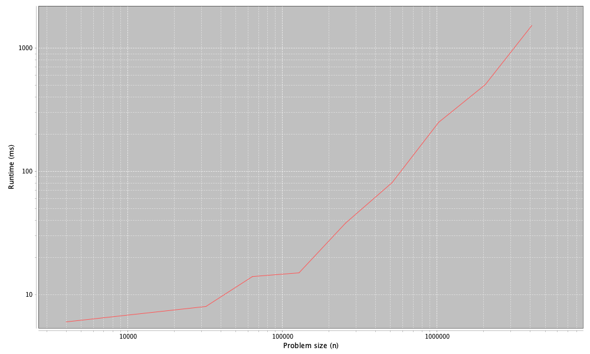

# 4. LinkedList 클래스

## MyLinkedList 메서드 분류하기

### indexOf
```java
@Override
public int indexOf(Object target) {
    Node node = head;
    for (int i = 0; i < size; i++) {
        if (equals(target, node.data)) {
            return i;
        }
        node = node.next;
    }
    return -1;
}
```

- equals는 상수시간
- 반복은 n번 실행
- 즉 `O(n)`

### add
```java
@Override
public void add(int index, E element) {
    if (index == 0) {
        head = new Node(element, head);
    } else {
        Node prev = getNode(index - 1);
        prev.next = new Node(element, prev.next);
    }
    size++;
}
```

-  `index == 0`은 예외사항
- getNode는 선형시간
- 그 외는 상수시간
- 즉 `O(n)`

### remove
```java
@Override
public E remove(int index) {
    Node old;
    if (index == 0) {
        old = head;
        head = old.next;
    } else {
        Node prev = getNode(index - 1);
        old = prev.next;
        prev.next = old.next;
    }
    size--;
    return old.data;
}
```

- getNode는 선형
- 이외는 상수시간
- 즉 `O(n)`


## MyArrayList와 MyLinkedList 비교

| 구분                | MyArrayList | MyLinkedList |
|:-------------------|:-----------:|:------------:|
|add(끝)              | 1           | n            |
|add(시작)            | n           | 1            |
|add(일반적)           | n           | n            |
|get/set             | 1           | n            |
|indexOf/lastIndexOf | n           | n            |
|isEmpty/size        | 1           | 1            |
|remove(끝)           | 1           | n            |
|remove(시작)         | n           | 1            |
|remove(일반적)        | n           | n           |

## 프로파일
Profiler 클래스는 문제 크기의 범위를 인자로 받아 실행하는 코드를 포함하며 
실행시간을 측정하고 결과를 그래프로 출력한다. 
이를 통하여 ArrayList와 LinkedList 클래스의 add 메서드의 성능을 분류한다. 

- Profiler
- ProfileListAdd

```text
4000, 2
8000, 2
16000, 3
32000, 6
64000, 13
128000, 10
256000, 52
512000, 249
1024000, 158
2048000, 356
4096000, 647
8192000, 1463
Estimated slope= 1.0090250744569609
```

## 결과 해석

- add 메서드를 통해 n개 요소를 추가하는 것은 `선형시간`이다
- 측정에 잡음이 많아서 정확하게 잴 수 없다면 log를 적용해 보는 것도 좋다.
  `cn^k`의 실행시간이 도출되는 함수라면 `log(실행시간) = log(c) + klog(n)`이다.
  이는 k에 따라 기울기가 달라지는 결과가 나올 것이다. 1에 가깝다면 선형, 2에 가깝다면 이차. 

## 실습

### ArrayList
#### Beginning


#### End


### LinkedList
#### Beginning


#### End


---
[Home](../README.md)
