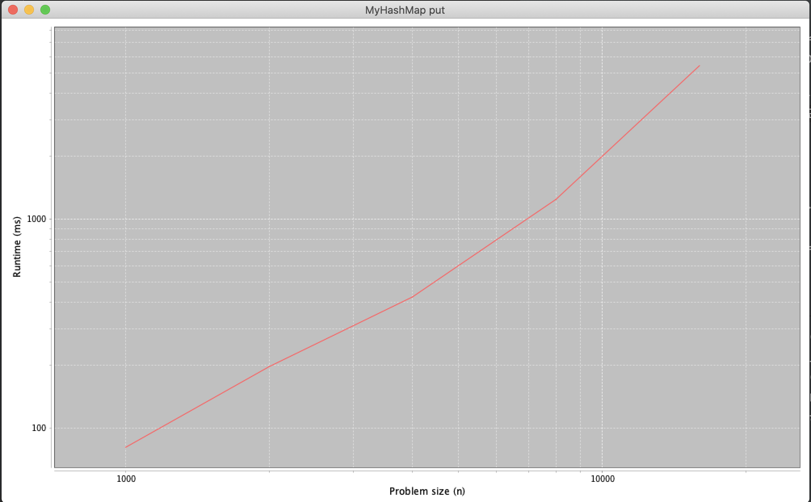

# 11. HashMap 클래스
이전 장에서 만든 Map 인터페이스의 구현체는 n개의 엔트리와 k개의 하위 맵이 존재한다면 엔트리를 찾는데는 평균적으로 n/k가 소요되고 이는 결국 선형이다. 하지만 n과 함께 k의 수를 늘려나간다면 n/k를 제한할 수 있게 된다.
따라서 하위 맵당 엔트리의 개수가 일정하면 단일 하위 맵을 찾는데는 `상수 시간`이 걸리며, 해시 함수는 일반적으로 `상수 시간`이므로 `put과 get 메서드를 상수 시간`으로 만든다. 

## 실습
- MyHashMap.java

```java
public class MyHashMap<K, V> extends MyBetterMap<K, V> implements Map<K, V> {
	protected static final double FACTOR = 1.0;

	@Override
	public V put(K key, V value) {
		V oldValue = super.put(key, value);

		if (size() > maps.size() * FACTOR) {
			rehash();
		}
		return oldValue;
	}
}
```

- FACTOR는 로드 팩터(load factor)라고 하여 하위 맵당 최대 엔트리 개수를 결정한다.
- `n > k * FACTOR`는 `n/k > FACTOR`를 의미하므로 하위 맵당 임계치를 넘으면 rehash()를 호출한다.

```java
protected void rehash() {
    Collection<Entry<K, V>> items = new ArrayList<>();
    for (MyLinearMap<K, V> map : maps) {
        items.addAll(map.getEntries());
    }

    makeMaps(maps.size() * 2);
    items.forEach(item -> put(item.getKey(), item.getValue()));
}
```

## MyHashMap 분석하기
n과 k가 같이 늘어나면서 MyBetterMap 클래스의 몇몇 핵심 메서드도 상수 시간이 된다.

- containsKey
- get
- remove

하지만 put는 재해시(rehash)를 하지 않는다면 상수 시간이지만, 재해시를 한다면 선형이 된다.
따라서 [분할 상환 분석](03-array_list.md)을 기반으로 판단하면 이는 상수 시간이라고 한다.

하위 맵의 개수 k의 초기값을 2, 로드 팩터가 1이라고 가정했을 때 일련의 키를 넣으면 얼마나 많은 작업이 발생하는지 알아본다. 기본 `작업 단위(unit of work)`로 키를 재해시하며 이 키를 하위 맵에 추가하는 횟수를 세어본다.

1. 첫 번째 키, put => 작업 단위 1
2. 두 번째 키, put => 작업 단위 1
3. 세 번째 키, put => 재해시, 새로운 키 해시 => 작업 단위 2 + 1
4. 네 번째 키, put => 작업 단위 1
5. 다섯 번쨰 키, put => 재해시, 새로운 키 해시 => 작업 단위 4 + 1

## 트레이드 오프

- 핵심 메서드가 상수 시간이 걸리므로 해시 테이블의 크기에 상관 없이 대개 성능이 일정하다. 
  하지만 물리적으로 캐시에 들어갈만한 크기가 아니면 메모리, 메모리도 맞지 않으면 디스크 등으로 내려가며 성능이 떨어질 것이다.
- 키가 아닌 값으로 검색해야 한다면 해싱이 그다지 도움이 되지 않는다는 것이다.
- MyLinearMap에 존재했던 clear 같은 함수는 하위 맵에 비례하여 실행되므로 선형이 된다.

## MyHashMap 프로파일링
- MyHashMap::put을 프로파일링해보면 상수 시간이 아닌 값이 나옴
    - 나의 경우는 `1.4792588212567526`
- 이는 `성능 버그`를 의미한다고 한다.



## MyHashMap 클래스 고치기
- put 메서드는 엔트리 개수가 증가함에 따라 하위맵도 증가한다.
- 이 때 size 메서드를 호출하는데 이는 선형이다.
```java
@Override
public int size() {
    // add up the sizes of the sub-maps
    int total = 0;
    for (MyLinearMap<K, V> map: maps) {
        total += map.size();
    }
    return total;
}
```

- 따라서 put 역시 선형이 된다.
- 간단한 해법으로는 엔트리 개수를 표현하는 인스턴스 변수를 선언하고 업데이트하는 것이다.
- remove와 put 메서드는 상위 클래스의 메서드를 호출할 때 맵의 크기가 변한지 알 수 없다.
    - remove는 하위맵이 갱신되면 사이즈만큼 빼고 다시 더한다.
    - put도 마찬가지로 하위맵이 갱신되면 사이즈만큼 뺴고 다시 더한다.
- 결과 개선되어 MyFixedHashMap::put은 프로파일링값이 `0.444755025850297`가 되었다.

```java
public class MyFixedHashMap<K, V> extends MyHashMap<K, V> implements Map<K, V> {

	private int size = 0;

	@Override
	public void clear() {
		super.clear();
		size = 0;
	}

    @Override
    public V put(K key, V value) {
        MyLinearMap<K, V> map = chooseMap(key);
        size -= map.size();
        V oldValue = map.put(key, value);
        size += map.size();

        if (size() > maps.size() * FACTOR) {
            size = 0;
            rehash();
        }
        return oldValue;
    }

    @Override
    public V remove(Object key) {
        MyLinearMap<K, V> map = chooseMap(key);
        size -= map.size();
        V oldValue = map.remove(key);
        size += map.size();
        return oldValue;
    }
}
``` 

## UML 다이어그램
- 머리가 꽉찬 화살표는 `HAS-A` 관계다. `A -> B`면 `A가 B를 갖고 있다`는 것이다.
- 빈 머리와 실선 화살표는 `IS-A` 관계다. `A -> B`면 `A가 B를 확장한다`는 것이다.
- 빈 머리와 점선 화살표는 `인터페이스 구현`을 의미한다. `A -> B`면 `A는 인터페이스 B를 구현한다`는 것이다. 

---
[Home](../README.md)
